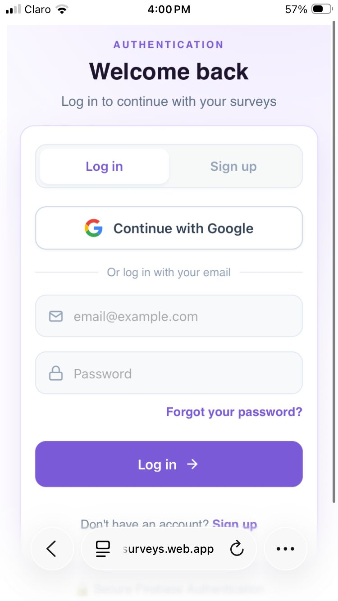
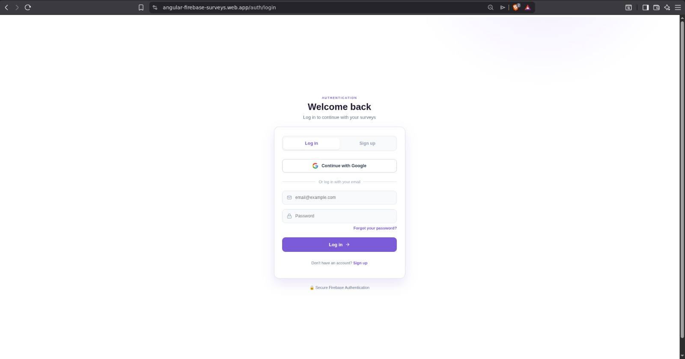
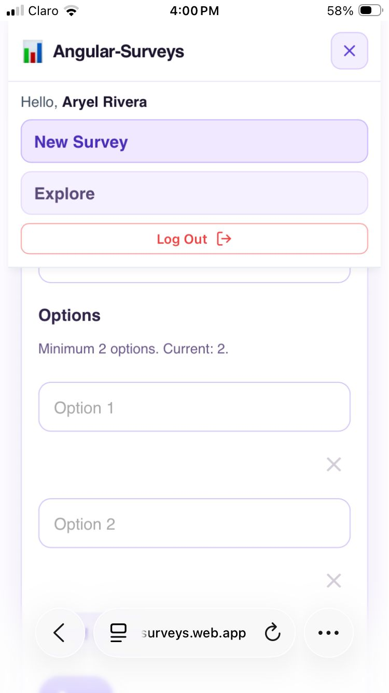
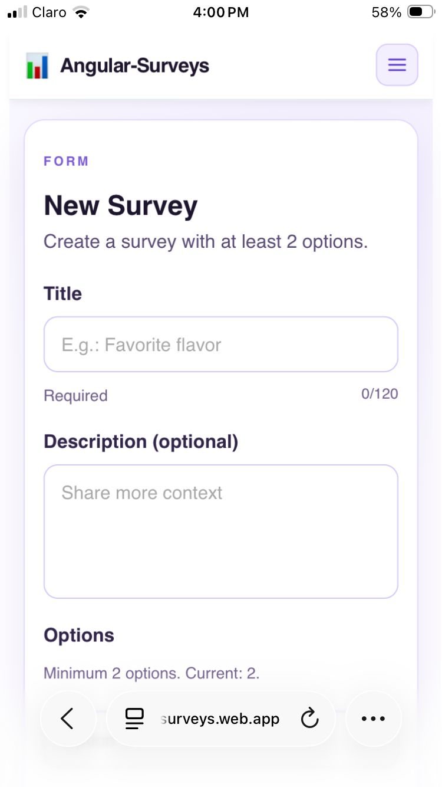
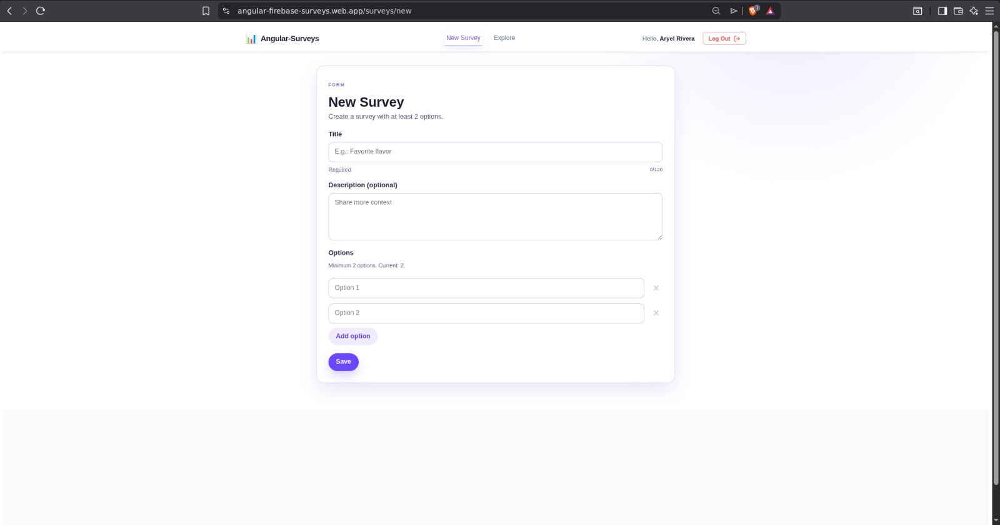
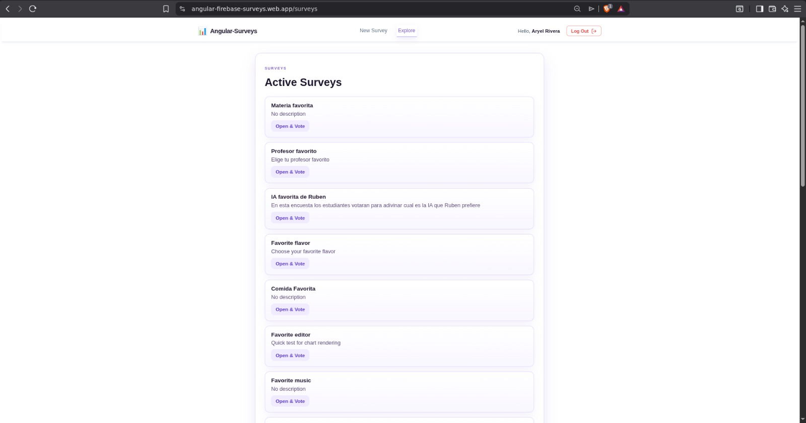
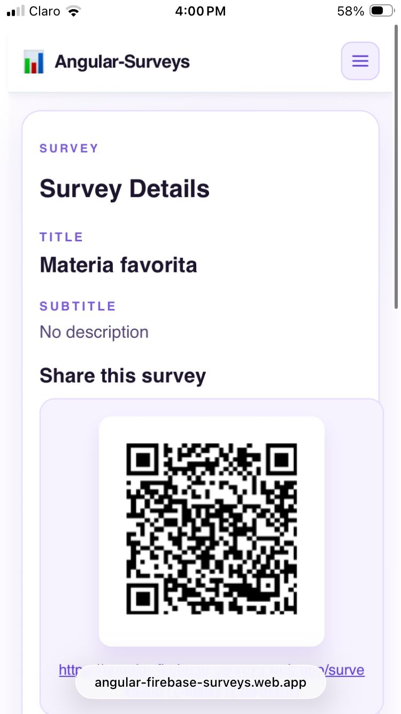
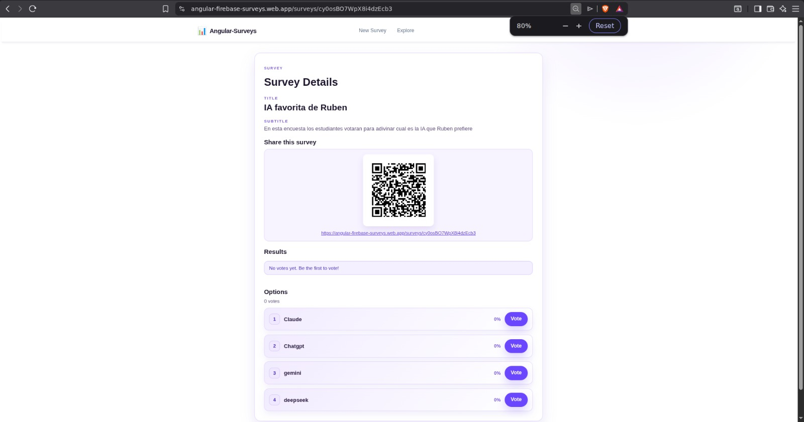
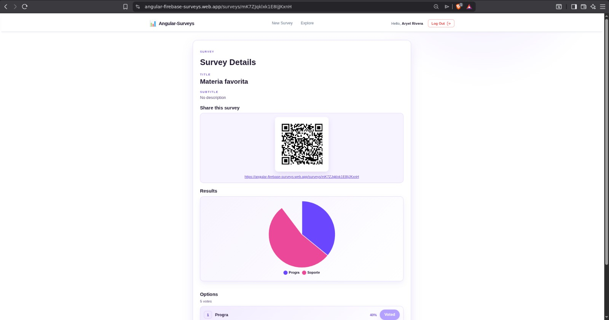
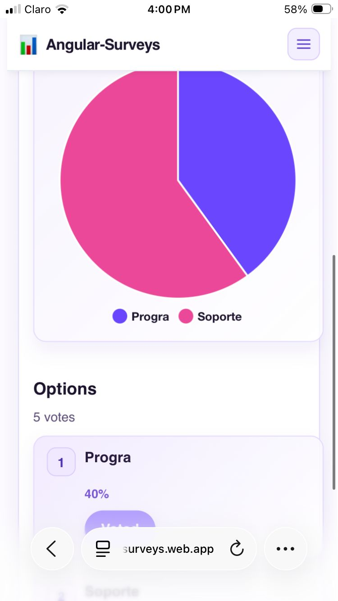

# Angular Firebase Surveys

Aplicación web de encuestas en tiempo real desarrollada con **Angular 20** y **Firebase** para la actividad EIF209. Permite autenticación de usuarios, creación de encuestas, votación con control de duplicados, visualización inmediata de resultados con gráficos y acceso rápido mediante QR.

**URL desplegada:** https://angular-firebase-surveys.web.app

---

## Tabla de contenidos

- [Descripción general](#descripción-general)
- [Tecnologías utilizadas](#tecnologías-utilizadas)
- [Arquitectura del proyecto](#arquitectura-del-proyecto)
- [Requerimientos cumplidos](#requerimientos-cumplidos)
- [Despliegue](#despliegue)
- [Desarrollo local](#desarrollo-local)
- [Capturas de pantalla](#capturas-de-pantalla)
- [Decisiones técnicas](#decisiones-técnicas)

---

## Descripción general

El proyecto resuelve el flujo completo de una encuesta en línea:

1. El usuario inicia sesión con Firebase Authentication (Google o correo).
2. Crea una encuesta con título, descripción opcional y al menos 2 opciones.
3. Comparte la encuesta con un QR que otros usuarios pueden escanear.
4. Otros usuarios autenticados votan desde su dispositivo.
5. Los resultados se actualizan en tiempo real sin recargar la página.
6. El sistema previene votos duplicados mediante Firestore Security Rules.

## Tecnologías utilizadas

| Área | Tecnología | Propósito |
|------|-----------|----------|
| **Frontend** | Angular 20 (standalone) | Framework moderno sin NgModule |
| **Reactivity** | Signals, `inject()` | Estado derivado y inyección |
| **Routing** | Angular Router con lazy loading | Carga bajo demanda de componentes |
| **Auth** | Firebase Authentication | Autenticación con Google y correo |
| **Database** | Firestore + listeners en tiempo real | Datos NoSQL con sincronización en vivo |
| **Hosting** | Firebase Hosting | Despliegue y distribución |
| **Gráficos** | Chart.js + ng2-charts | Visualización de resultados con pastel |
| **QR** | angularx-qrcode | Generación de códigos QR compartibles |

## Arquitectura del proyecto

- `src/main.ts` arranca la aplicación con `bootstrapApplication()`.
- `src/app/app.config.ts` registra router, Firebase, Auth, Firestore y Chart.js a nivel global.
- `src/app/app.routes.ts` define las rutas y carga perezosa de las pantallas principales.
- `src/app/services/auth.ts` centraliza la autenticación con Firebase.
- `src/app/surveys/` contiene la creación, detalle y visualización de encuestas.
- `src/app/guards/auth.guard.ts` protege las rutas privadas.
- Firestore guarda encuestas y votos en colecciones separadas para mantener el modelo NoSQL ordenado y barato.

## Estructura de datos

- `surveys`: colección principal con los datos de cada encuesta.
- `surveys/{surveyId}/options`: opciones disponibles para votar.
- `surveys/{surveyId}/votes`: votos emitidos por los usuarios.

Este enfoque facilita consultar resultados en tiempo real y restringir votos duplicados desde las reglas de seguridad.

## Flujo de funcionamiento

### Autenticación

- El usuario puede entrar con Google o con correo y contraseña.
- Solo usuarios autenticados pueden crear encuestas, votar y ver detalles completos.

### Creación de encuestas

- El formulario solicita título, descripción opcional y al menos dos opciones.
- Al guardar, la encuesta queda disponible para otros usuarios autenticados.

### Votación

- Cada usuario puede emitir un único voto por encuesta.
- Firestore Security Rules evitan que un usuario vote dos veces.

### Resultados en tiempo real

- Los cambios en Firestore se reflejan de inmediato en la pantalla de detalle.
- El gráfico se actualiza automáticamente cuando entran nuevos votos.

### QR de acceso

- Cada encuesta puede compartirse con un QR que apunta a la URL pública del despliegue.

## Seguridad y reglas

- Firebase Authentication protege el acceso a las funciones principales.
- Firestore Security Rules limitan quién puede crear, editar o votar.
- El esquema de datos evita duplicar información y reduce lecturas innecesarias.

## Despliegue

- **URL pública:** https://angular-firebase-surveys.web.app
- **Hosting:** Firebase Hosting configurado para SPA.
- **Build output:** `dist/angular-firebase-surveys/browser`
- **Rewrite:** Todo tráfico hacia `/index.html` para Angular routing.

### Configuración inicial de Firebase

1. Instala Firebase CLI si no lo tienes:
   ```bash
   npm install -g firebase-tools
   ```

2. Inicia sesión en Firebase:
   ```bash
   firebase login
   ```

3. Inicializa Firebase en el proyecto (si aún no está hecho):
   ```bash
   firebase init hosting
   ```

### Comandos de despliegue

**Con build:**
```bash
npm run build && firebase deploy --only hosting
```

**Solo hosting (si el build ya existe):**
```bash
firebase deploy --only hosting
```

**Deploy completo (hosting + Firestore rules + indexes):**
```bash
firebase deploy
```

## Desarrollo local

### Requisitos previos

- Node.js 20+
- npm o yarn
- (Opcional) Firebase CLI para emulador

### Instalación y arranque

```bash
# Instalar dependencias
npm install --legacy-peer-deps

# Iniciar servidor de desarrollo
npm start
```

Abre `http://localhost:4200/` en tu navegador. La app se recargará automáticamente al detectar cambios en el código.

### Build de producción

```bash
npm run build
```

Los artefactos compilados se guardarán en `dist/angular-firebase-surveys/browser`.

## Capturas de pantalla

Las capturas están organizadas por versión móvil y escritorio para mostrar el comportamiento responsive del sistema.

### Autenticación

**Móvil**



**Escritorio**



### Menú móvil



### Creación de encuesta

**Móvil**



**Escritorio**



### Lista de encuestas



### Detalle y votación

**Móvil**



**Escritorio**



### QR y resultados

**Móvil**


**Escritorio**



### Gráfico en móvil



## Decisiones técnicas

### ¿Por qué Angular standalone?

Los componentes standalone reducen la complejidad de la arquitectura, evitan NgModule, y facilitan pruebas unitarias. Con lazy loading, cada ruta carga su componente bajo demanda, optimizando el bundle inicial.

### ¿Por qué Signals?

Signals reemplazan RxJS observables en Angular 20 para estado simple y derivado. Son más previsibles, tienen mejor performance en change detection y hacen el código más legible que las subscripciones manuales.

### ¿Por qué subcolecciones en Firestore?

Mantener `surveys/{surveyId}/votes` como subcolección permiteStructu consultas rápidas y eficientes (muy importante en la capa gratuita de Firebase), además que facilita aplicar reglas de seguridad granulares por votante.

### ¿Por qué Chart.js con pastel?

Un gráfico de pastel es intuitivo para mostrar proporciones de votos en una encuesta. Chart.js es ligero, flexible y se integra bien con Angular via ng2-charts, con capacidad de listeners en tiempo real.

### ¿Por qué QR?

Un QR es la forma más rápida de compartir una encuesta en redes sociales o por WhatsApp sin que el usuario tenga que escribir un enlace largo.

### ¿Por qué mobile first?

El 80% del tráfico web es mobile. Comienza con estilos base para dispositivos pequeños y escala hacia arriba evita estilos conflictivos y garantiza que todos los breakpoints funcionen.

### ¿Por qué Firebase Hosting?

Firebase Hosting integrado simplifica el despliegue (sin configurar servidores), ofrece HTTPS automático, CDN global, redirecciones SPA nativas, y acoplamiento natural con Authentication y Firestore.

## Notas finales

- La aplicación fue construida sin `NgModule` estrategia moderna de Angular.
- Se priorizó un diseño **mobile first** para funcionar bien en teléfonos.
- Los resultados se muestran con un **gráfico de pastel** para lectura simple y directa.
- Todas las reglas de seguridad están documentadas en `firestore.rules`.

## Licencia

Proyecto académico para la actividad EIF209.
